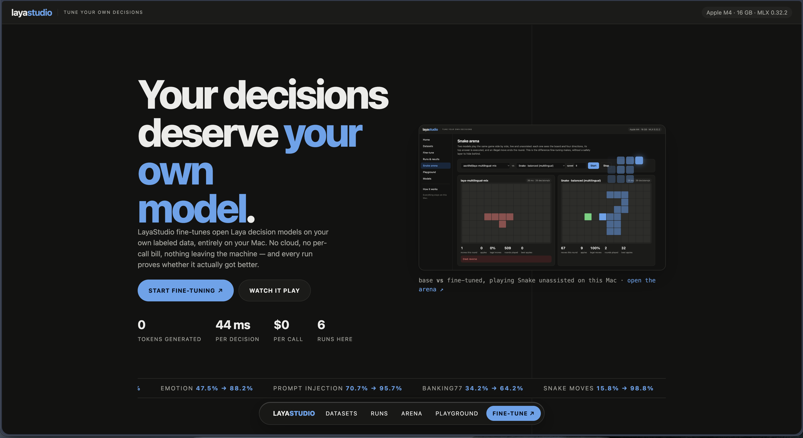
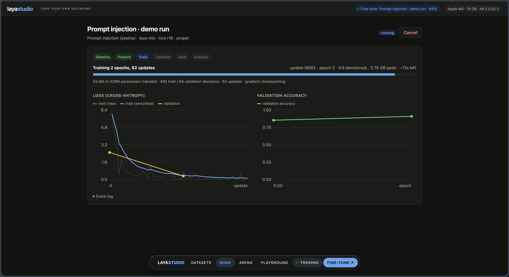
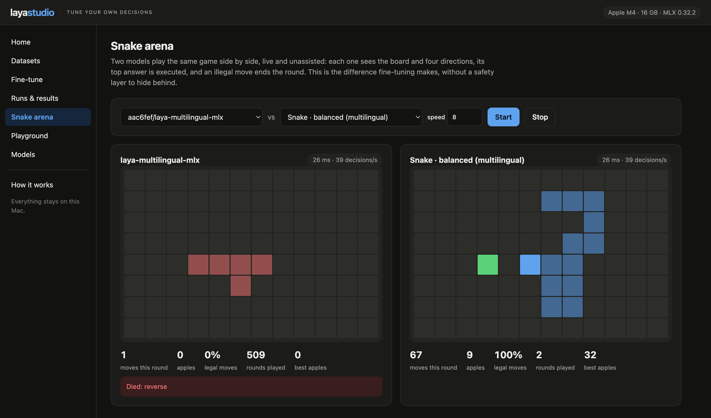
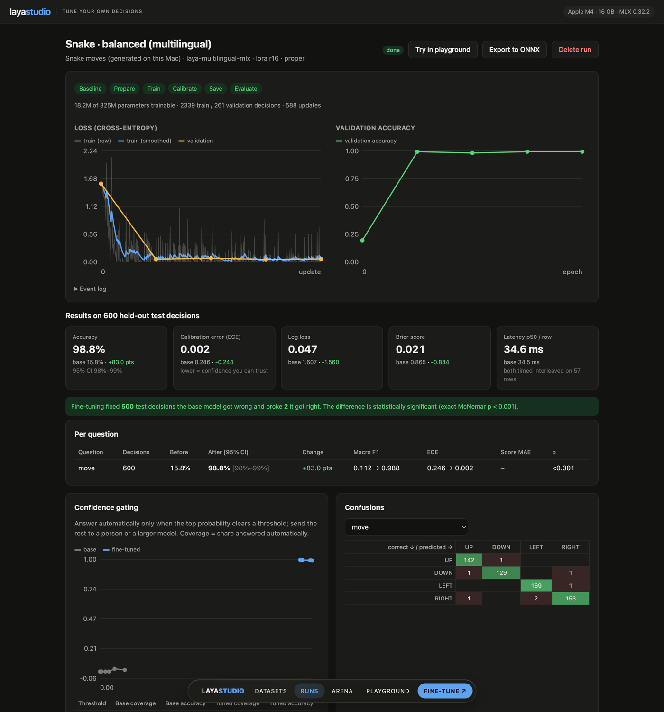
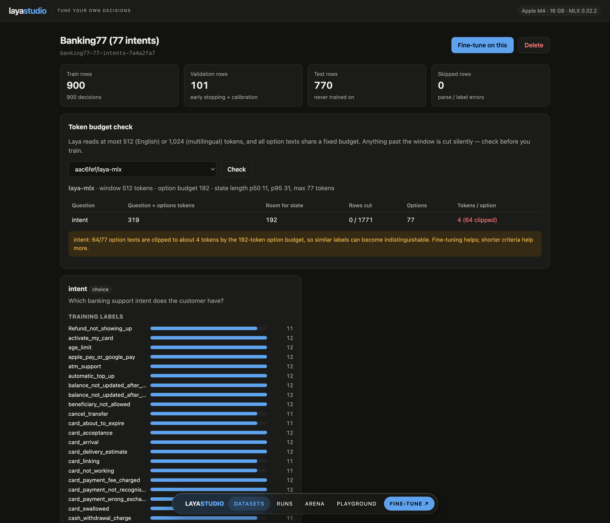
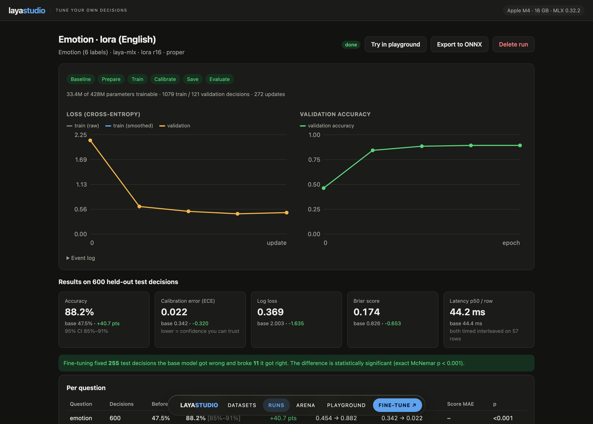
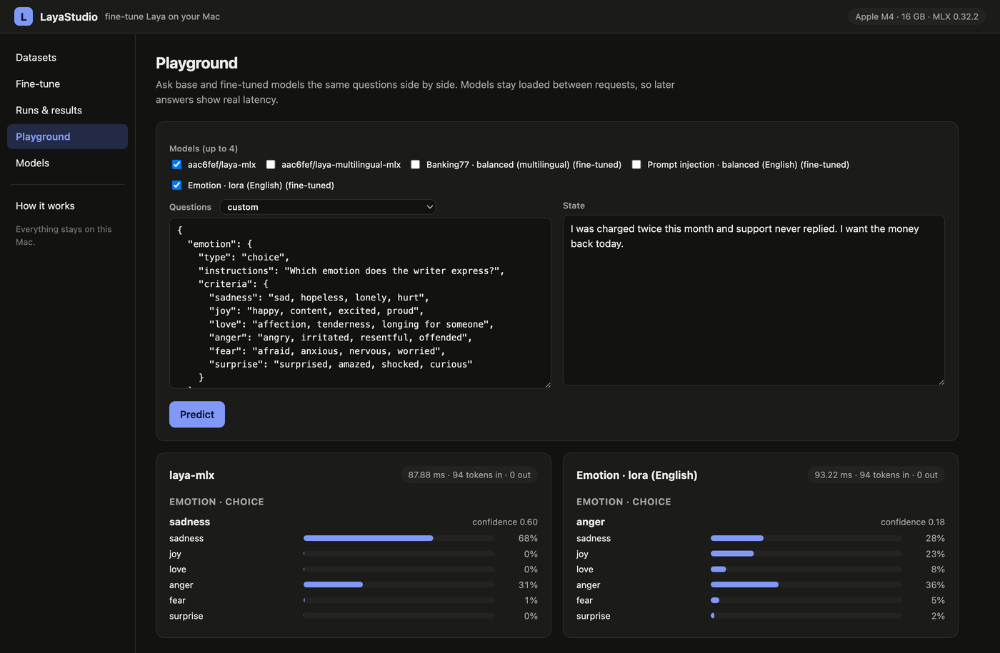
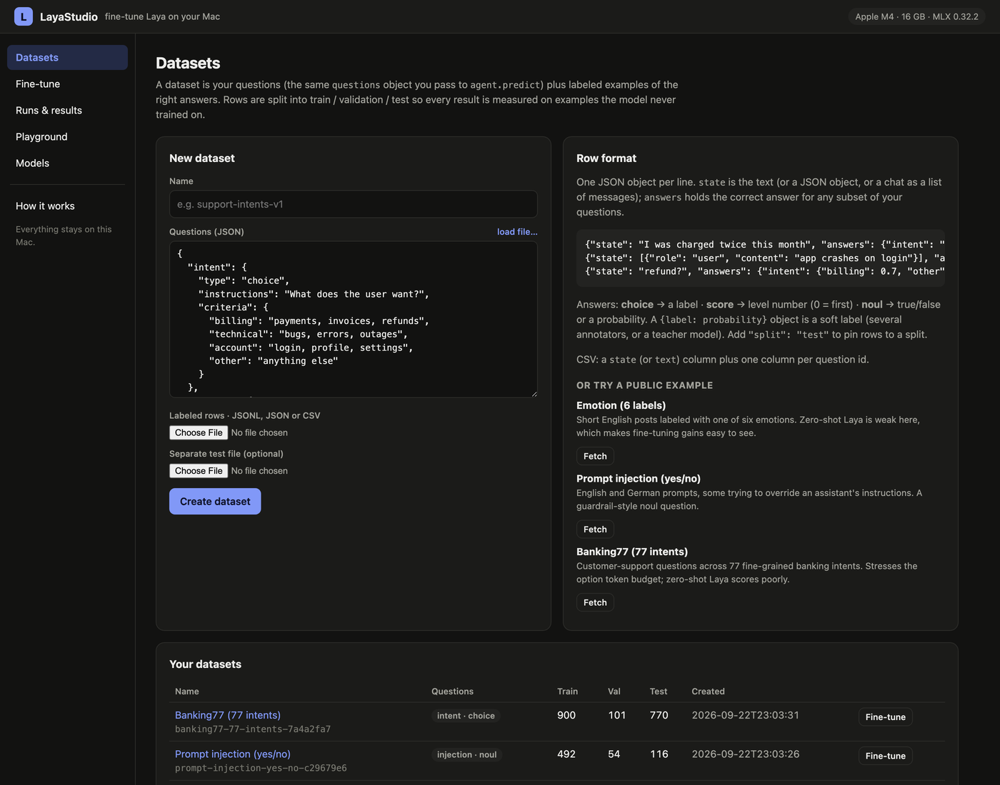

<div align="center">

<picture>
  <source media="(prefers-color-scheme: dark)" srcset="docs/logo.png">
  
</picture>

**Build your own decision engine on your Mac, in minutes.**

Fine-tune [Laya](https://github.com/NandhaKishorM/laya) typed-decision models on your own data, locally — and prove the result is better before you ship it. For the decisions *your* product makes, a small model you tuned yourself can beat a general hosted API: more accurate on your labels, ~10× faster because there is no network, and free to run.

[](LICENSE)
[](https://www.python.org/)
[](https://github.com/ml-explore/mlx)
[](https://pypi.org/project/laya-mlx/)
[](#privacy-and-security)

**[layastudio.biplovgautam.com.np](https://layastudio.biplovgautam.com.np)** · [the published Snake model](https://huggingface.co/madhavbiplov/laya-snake-mlx)

```bash
git clone https://github.com/biplovgautam/LayaStudio && cd LayaStudio && uv run layastudio
```

That is the whole setup. The browser opens, and the studio finishes preparing itself in the background — it detects your Mac, checks the MLX runtime, downloads a base checkpoint and fetches the public example datasets, showing every step on the page.

</div>



---

## Why

Laya answers typed questions — `choice`, `score`, `noul` — in a single forward pass, locally, with calibrated probabilities and **zero generated tokens**. It is fast and free to run. But the public checkpoints are general-purpose: on one product's own decisions they are often fast and *not accurate enough*, the same pattern the community reports (Banking77 goes from ~51% to ~79% once fine-tuned).

The only published way to fine-tune Laya is a PyTorch notebook for two cloud GPUs, which means copying your data to someone else's machine. LayaStudio came out of needing the opposite: adapt Laya to a real product's decisions **on the laptop**, without the data ever leaving it, and with honest before/after measurement so "fine-tuned" is a number rather than a feeling.

The goal is simple: **any Mac owner should be able to turn a general model into a specialist for their own decisions, in minutes, and see exactly how much better it got.**

It is built on top of [`laya-mlx`](https://pypi.org/project/laya-mlx/), the native MLX runtime for Laya, and it is a separate project: an app around that runtime, not a fork of it.

### Local specialist vs hosted decision API

| | Hosted decision API | Fine-tuned Laya, here |
|---|---|---|
| Latency | ~300–700 ms per call, network-bound (community reports) | **44 ms** on an M4, measured below |
| Cost | per call, forever | **$0** after the download |
| Accuracy on *your* labels | general-purpose | trained on your data — see the table below |
| Data | leaves your machine | never leaves it |
| Offline | no | yes |

Latency and price for hosted APIs are as reported by the community catalog at [madewithlaya.com](https://www.madewithlaya.com/); we did not run a paid API ourselves, so treat those as their numbers, not ours. Everything in the tables below was measured on the machine described.

## What you get

|  |  |
|---|---|
| 🧪 **Honest measurement** | Every run scores the base model first, trains with early stopping, then scores both on the same untouched test split — with Wilson confidence intervals and an exact McNemar test |
| ⚡️ **LoRA on Apple silicon** | Low-rank adapters on the encoder plus the full decision head, in MLX. No PyTorch, no CUDA, no cloud |
| 🎛 **Calibration refit** | Temperatures refit per question type and option count, so the probabilities you gate on stay meaningful |
| 🔍 **Token-budget check** | Shows which rows get silently cut and which option labels get clipped *before* you spend an hour training |
| 🚦 **Production view** | Coverage/accuracy table for confidence gating, confusion matrices, and the most confident remaining mistakes |
| 📦 **Portable output** | LoRA merged back: a standard Laya checkpoint, plus verified ONNX and Core ML exports in float, int8 or int4 — int8 Core ML answers identically at 308 MB and 8.8 ms, 4.1× faster than the runtime that trained it |
| 🔒 **Local by construction** | Binds to 127.0.0.1, no external scripts in the page, jobs run with `HF_HUB_OFFLINE=1` |
| 🐍 **Proof, not vibes** | A built-in Snake task where the fine-tuned model plays *unassisted* — the base model dies on move one |
| 🎛 **A studio, not a script** | A landing page, live training charts, a side-by-side playground and a Snake arena — all served from one local file |

## Install and run

Requirements: an Apple silicon Mac (M1 or newer), macOS 14+, Python 3.11+.

```bash
# with uv (recommended — it creates the environment for you)
git clone https://github.com/biplovgautam/LayaStudio && cd LayaStudio && uv run layastudio

# or with pip
python3 -m venv .venv && source .venv/bin/activate
pip install -e .
layastudio
```

Useful flags: `--port 8800`, `--workspace ~/laya-work`, `--no-download` (never fetch a model), `--no-examples`, `--no-browser`.

### What the first start does

| Step | What happens |
|---|---|
| **Checking this Mac** | Chip, cores, memory, macOS — and the batch size and recipe that suit them |
| **Loading the MLX runtime** | `laya-mlx` and MLX versions, and how much memory the GPU may use |
| **Preparing the workspace** | Creates `workspace/`, counts what is already there, checks free disk space |
| **Getting a base model** | Downloads `aac6fef/laya-mlx` (English, 421M) into the Hugging Face cache, with a progress bar |
| **Fetching a ready-made fine-tune** | Downloads the published Snake model so the arena works immediately |
| **Fetching example datasets** | Pulls the public examples from their source URLs — nothing is stored in git |

Every step reports on the page, and nothing blocks you from looking around while it runs.

## Try it without training anything

The studio ships with a ready-made fine-tune. At startup it downloads
[`madhavbiplov/laya-snake-mlx`](https://huggingface.co/madhavbiplov/laya-snake-mlx) — the
Snake model from the table below — so the **Snake arena** has something to play the moment
the page opens: the base checkpoint on the left, the fine-tune on the right, same rules,
no safety layer.

A cold start on an M4 takes **40 seconds** end to end: machine check, runtime check, base
model, that fine-tune and the four example datasets. Playing straight from the published
copy: **196 moves, 25.7 apples, 99.4% legal moves, 40.7 decisions per second**.

```bash
LAYASTUDIO_DEMO_MODELS="" uv run layastudio     # skip it, if you would rather not
```

### Publishing your own run

Your fine-tuned checkpoints are yours. To put one on the Hub with a model card built from
that run's measured numbers:

```bash
hf auth login                              # your own token, once; "Manage repositories" is enough
```

```bash
uv run python -m layastudio.publish run:<run-id> --repo <you>/<name>   # --dry-run writes the card only
```

The namespace has to be yours: publishing to someone else's returns a 403 before anything
uploads.

To put the same run on [systemonemodels.tech](https://systemonemodels.tech), the registry
for System One models, where the page shows the run's accuracy, calibration and latency as
fields and links the base model:

```bash
pip install systemonemodels && systemone login          # once; approves this machine in the browser
```

```bash
uv run python -m layastudio.publish_systemone run:<run-id>   # --repo <you>/<name> to choose the name
```

Or open the run in the studio and press **Publish to System One**. Both write a card from
the run's measurements, then hand the checkpoint to `systemone push`.

The card carries the before/after table, the significance test, the calibration
temperatures, the hyperparameters and the dataset hash from that run, so what the Hub
claims is what the studio measured. Add the repository to `LAYASTUDIO_DEMO_MODELS` (or
`DEMO_MODELS` in `layastudio/engine.py`) and it will be fetched at startup like the one
above.

## Five-minute tour

1. **Datasets** → the examples are already there (Emotion, prompt injection, Banking77, Snake), or upload your own JSONL/CSV.
2. **Fine-tune** → pick a dataset, keep the *Balanced* recipe, press start. Watch loss and validation accuracy live.
3. **Runs & results** → read accuracy before/after, calibration, significance, gating and the remaining mistakes.
4. **Playground** → *Try in playground* compares the base and fine-tuned models side by side on any text.



## Measured results

Real runs on a **MacBook with an Apple M4 and 16 GB**, default *Balanced* recipe (LoRA r16 on every encoder layer + full decision head, 4 epochs, `proper` objective). Test rows were never trained on.

| Dataset | Base model | Train rows | Test decisions | Accuracy before → after | Macro F1 | ECE | Fixed / broke | McNemar p | Time |
|---|---|---:|---:|---|---|---|---|---|---:|
| Emotion, 6 labels | English 421M | 1,079 | 600 | **47.5% → 88.2%** | 0.45 → 0.88 | 0.342 → 0.022 | 255 / 11 | <1e-60 | 11.8 min |
| Prompt injection, yes/no | English 421M | 492 | 116 | **70.7% → 95.7%** | 0.69 → 0.96 | 0.280 → 0.027 | 29 / 0 | 4e-9 | 5.7 min |
| Banking77, 77 intents | Multilingual 322M | 900 | 770 | **34.2% → 64.2%** | 0.32 → 0.63 | 0.462 → 0.024 | 246 / 15 | 5e-55 | 18.4 min |
| Snake moves, 4 directions | Multilingual 322M | 2,339 | 600 | **15.8% → 98.8%** | 0.11 → 0.99 | 0.246 → 0.002 | 500 / 2 | <1e-140 | 18.3 min |

Notes, because numbers without caveats are marketing: Banking77 squeezes 77 labels into one option budget, so its labels are clipped to about four tokens each — that is the architecture's known weak spot, and its validation accuracy was still climbing at the last epoch (more epochs or the 421M English model would go further). The public community fine-tune reached ~79% with the English model and more data.

**Fine-tuning does not change latency.** Timed interleaved on the same rows: 44.4 ms (base) vs 44.2 ms (fine-tuned) per row, English model, 6-label questions.

### Which objective?

`proper` is the default because it was measured, not assumed — same dataset, same base model, same hyperparameters, only the objective changed:

| Objective | Accuracy | Macro F1 | ECE | Log loss | Time |
|---|---|---|---|---|---|
| **`proper`** — maximize the RLCD reward directly | **88.2%** | 0.882 | **0.022** | **0.369** | 11.8 min |
| `rlcd` — the upstream policy-gradient recipe | 79.2% | 0.796 | 0.035 | 0.614 | 13.0 min |

The deterministic version of the same reward wins by nine points here and calibrates better; the noisy policy gradient is still available for fidelity to the published recipe.

**Fine-tuning makes confidence gating usable.** Emotion, answering only decisions the model is ≥90% sure about:

| | Answered automatically | Accuracy of those |
|---|---:|---:|
| Base | 49% | 59.3% |
| Fine-tuned | **76%** | **95.6%** |

Your numbers will differ — these are public benchmarks, not your traffic.

## Does it really learn? The Snake test

Classification accuracy is easy to believe. Playing a game is not: the model has to act, and a wrong move ends the run. So LayaStudio ships a Snake task as a built-in example, and it is deliberately harder than the well-known Laya Snake demo — in that demo a classical planner labels each option ("Safe. Best route to food."), so the model only reads labels.

Here the model gets the **board** and the facts a game engine already has — which neighbouring cells are free, and where the food is — and four plain directions. No advice, no safety layer, no retries:

```text
Snake 12x8. Head (6, 2). Food (6, 4) (2 down). Length 8.
Next to the head: UP reverse, DOWN free, LEFT free, RIGHT body.
Board, top row first: . empty, H head, o body, F food.
............
......oo....
......Ho....
.......o....
......Fo....
.......o....
.......o....
............
```

Training rows come from a planner that keeps room to survive and then heads for the food, with 20% exploration so the data covers the messy boards a fumbling player creates. Then the model plays **unassisted**: its top-1 answer is executed, and an illegal move is a death.

| Playing 10 unassisted games | Move accuracy (600 held-out boards) | Moves survived (mean / best) | Apples eaten (mean / best) | Legal moves | Agreement with the planner | Speed |
|---|---|---|---|---|---|---|
| Base multilingual 322M | 15.8% | **1.0** / 1 — dead on the first move of every game | 0.0 / 0 | 0% | 0% | 43 decisions/s |
| **Fine-tuned, 18 min on an M4** | **98.8%** | **169** / 304 | **19.8** / 33 | **99.3%** | **97.9%** | 31 decisions/s |
| The planner it learned from (ceiling) | 100% | 418 / 500 (cap) | 34.4 / 38 | 100% | 100% | — |

The base model is not "a bit worse" at Snake, it is guessing. Neither public checkpoint has seen this task, and it shows — measured on 300 held-out boards and six unassisted games each:

| Base checkpoint (no fine-tuning) | Move accuracy | Mean confidence | Directions it picks | Moves survived | Legal moves |
|---|---|---|---|---|---|
| English 421M | 33.0% | 0.008 | DOWN 64%, UP 35%, LEFT/RIGHT 2% | 3.2 | 65% |
| Multilingual 322M | 19.0% | 0.056 | UP 47%, LEFT 41%, DOWN 12%, RIGHT 0% | 1.0 | 0% |

Random guessing would be 25%. Both models are essentially answering from a prior over option positions rather than from the board — confidence near zero, whole directions never chosen — and the multilingual one's prior happens to be worse here: it never plays RIGHT, so the first forced turn is an illegal reversal and the round ends on move one. That is a statement about an untrained model on an unseen task, not about the multilingual checkpoint in general; on non-English text it is the stronger of the two, which is why it is the one worth fine-tuning for a multilingual product. After 18 minutes of fine-tuning on 2,339 boards generated on the same laptop, the same 322M model picks a legal move 99.3% of the time and eats ~20 apples a game, at 31 decisions a second with no network and no safety net.

Raw per-game results: [`docs/snake-benchmark.json`](docs/snake-benchmark.json).

You can watch this happen: the **Snake arena** in the studio plays both models side by side, live, on the same rules. Below, the base model has just died on the first move of its 509th round while the fine-tuned one is mid-game with 100% legal moves.





```bash
python -m layastudio.snake dataset                    # generate the boards locally
python -m layastudio.snake bench --model run:<id>     # play unassisted
python -m layastudio.snake teacher                    # the planner's own ceiling
```

## Screenshots

| Token budget check | Confidence gating and confusions |
|---|---|
|  |  |

| Side-by-side playground | Datasets |
|---|---|
|  |  |

## How Laya works

Laya does not generate text. It **scores the options you give it**, one forward pass per question:

```text
[CLS] choice question: Which team should handle this? [SEP]
[MASK] billing: payments, refunds  [MASK] technical: bugs, outages  [MASK] other [SEP]
I was charged twice this month… [SEP]
        │
        ▼  bidirectional encoder: ModernBERT-large (421M) or mmBERT-base (322M)
        ▼  + question-type embedding (choice / score / noul)
        ▼  2-layer decision transformer
        ▼  scorer MLP at each [MASK] → one logit per option
        ▼  softmax(logits / fitted temperature) → calibrated probabilities
```

- `choice` picks a label, `score` rates on an ordered rubric, `noul` returns P(true).
- It can only answer with the options you provide, so it cannot invent a label — and it cannot say "none of these", so include an `other` option.
- The pretrained models were trained with **RLCD**: rewards from *strictly proper scoring rules* (log, spherical, ranked probability), which are maximized only by honest probabilities.

## How fine-tuning works here

1. **Baseline** — the base model answers the test split through the normal `predict` path (cached per model + dataset).
2. **LoRA** — every encoder attention/MLP matrix gets a trainable `W + (α/r)·A·B`; base weights stay frozen in bfloat16 while the decision head, scorer and type embedding train in float32. For the 421M English model: **33.4M of 428M** parameters.
3. **Objective** — `proper` (default) maximizes the RLCD reward directly; `rlcd` reproduces the upstream notebook (annealed Gaussian logit noise, group-normalized policy gradient, plus cross-entropy); `ce` is plain cross-entropy.
4. **Regularization** — choice options reshuffled every epoch so the model learns labels, not positions; head dropout 0.1 as upstream; optional class weighting.
5. **Early stopping** on validation loss, keeping the best epoch.
6. **Calibration** — temperatures refit per `(question type, option count)` on validation, clamped to [0.5, 5].
7. **Export** — LoRA merged into the weights; FP16 safetensors with the original PyTorch parameter names.
8. **Evaluation** — the fine-tuned model answers the same test rows; the report compares the two.

## Your data

**1. Questions** — the same object you already pass to `agent.predict`. Keep it identical after training: instructions and option texts are part of the model's input.

```json
{
  "intent":   {"type": "choice", "instructions": "What does the user want?",
               "criteria": {"billing": "payments, refunds", "technical": "bugs, errors", "other": "anything else"}},
  "urgency":  {"type": "score", "instructions": "How urgent is this?",
               "criteria": ["can wait", "soon", "blocking right now"]},
  "escalate": {"type": "noul", "instructions": "Should a human take over?"}
}
```

**2. Labeled rows** — JSONL, a JSON array, or CSV/TSV.

```json
{"state": "I was charged twice this month", "answers": {"intent": "billing", "urgency": 1, "escalate": false}}
{"state": [{"role": "user", "content": "app crashes on login"}], "answers": {"intent": "technical"}}
{"state": {"subject": "Invoice", "body": "…"}, "answers": {"intent": {"billing": 0.7, "other": 0.3}}}
```

- `state` is text, a JSON object, or a conversation — exactly what you will send in production.
- A row may label any subset of the questions.
- `choice` → the label · `score` → the level index from 0 · `noul` → `true`/`false` or a probability.
- `{label: probability}` is a **soft label**: for disagreeing annotators, or to distil a larger model's judgments into Laya.
- `"split": "train" | "val" | "test"` pins a row; otherwise rows split 80/10/10, stratified by label.
- CSV needs a `state` (or `text`) column plus one column per question id.

**How much?** ~30 examples per label to start, 100+ to be solid; 200+ test decisions so the confidence interval is tight enough to act on. Run the **token budget check** first: the English model reads 512 tokens and the multilingual one 1,024, longer states are cut from the end silently, and option texts share a 192/256-token budget.

## Recipes

| Recipe | What trains | When |
|---|---|---|
| **Balanced** (default) | LoRA on every encoder layer + full decision head | Best accuracy per minute; start here |
| **Fast** | LoRA on the top 8 encoder layers | Iterating on data or labels |
| **Head only** | Decision head, scorer, type embedding | Quick sanity check |
| **Full top layers** | Top 4 encoder layers unfrozen, lower LR | Large datasets where LoRA plateaus |

Advanced settings cover epochs, batch size, gradient accumulation, learning rates, LoRA rank/alpha, objective, class weighting, precision, option shuffling, patience and seed. Defaults are in `HYPERPARAMETERS` in [`layastudio/engine.py`](layastudio/engine.py), and the studio adapts batch size to the memory it finds.

## Performance and memory

| | English 421M | Multilingual 322M |
|---|---|---|
| Training throughput (Balanced, M4) | ~7 decisions/s | ~4 decisions/s at 77 options |
| Peak GPU memory, 512-token batches | **2.6 GB** | 2.3 GB |
| Inference after fine-tuning | unchanged | unchanged |

Three things keep long inputs safe on a 16 GB machine, each found by measuring:

- **Gradient checkpointing** turns on automatically for long batches: 13.6 GB → 2.9 GB at 512 tokens, at the same speed.
- **Gradients are materialized every microbatch.** A lazy graph spanning microbatches, the gradient clip and the optimizer step peaked at 12.3 GB; the same epoch now peaks at 2.6 GB.
- **MLX's buffer cache is capped.** Uncapped, it grew past 10 GB in a few dozen steps as batch shapes varied, and pushed the machine into swap.

## The checkpoint, and other hardware

```
workspace/runs/<run>/model/
├── model.safetensors      FP16, original PyTorch parameter names (LoRA merged)
├── rl_agent_config.json   refit temperatures + fine-tuning provenance
├── encoder/config.json    tokenizer/
├── questions.json         the questions this model was trained for
└── laya_finetune.json     base model, dataset hash, hyperparameters, metrics
```

```python
import json, laya_mlx as laya

agent = laya.load("workspace/runs/<run>/model")
questions = json.load(open("workspace/runs/<run>/model/questions.json"))
agent.predict("your text", questions)
```

Because the layout and tensor names match the original checkpoints, the same folder loads in the upstream PyTorch `laya` package on Linux CPUs and NVIDIA GPUs. Verified rather than assumed: a fine-tuned checkpoint loaded with upstream `laya` on CPU gave **40/40 identical answers** and a maximum probability difference of **0.0000** against this MLX runtime.

### Exporting to other runtimes

```bash
uv sync --extra export
python -m layastudio.export run:<id> --target onnx                     # or pick it on the run page
python -m layastudio.export run:<id> --target onnx --precision int8    # smaller
```

The export writes `model.onnx` (opset 18, dynamic batch, tokens and options) next to the tokenizer, the calibration temperatures and the questions the model was trained for — everything a server needs, with no Laya code required to run it. It goes wherever onnxruntime goes: Linux and Windows CPUs, NVIDIA CUDA, DirectML.

**Core ML**, for the Apple Neural Engine:

```bash
uv run --python 3.12 --extra coreml --extra export \
  python -m layastudio.export run:<id> --target coreml --precision int8
```

Three rewrites make the graph convertible, each checked against the original before
conversion: ModernBERT's mask builder is lifted out of the graph, the masks become
additive floats instead of booleans, and the marker lookup becomes a one-hot matmul
instead of a gather. The export then goes through `torch.export` rather than TorchScript,
and the graph is shaped around the rows it will actually be asked about. It needs a Python
version coremltools ships binaries for (3.12 works, 3.14 does not); the studio says so
plainly if you run it on the wrong one.

#### What each export actually costs

Exports are verified, not assumed. Every one of them is run on the **same held-out rows as
the model it came from**, next to this machine's MLX runtime, and the studio records the
accuracy, the agreement and the speed. The Snake checkpoint, on an Apple M4 with 16 GB:

| Runtime | Precision | Size | Per decision | Accuracy | Same answer as MLX |
|---|---|---|---|---|---|
| MLX (the runtime that trained it) | fp16 | 1.2 GB | 36.2 ms | 98.0% | — |
| **Core ML** | **int8** | **308 MB** | **8.8 ms** | **98.0%** | **100%** |
| Core ML | fp16 | 614 MB | 9.0 ms | 98.0% | 100% |
| Core ML | int4 | 154 MB | 8.9 ms | 70.0% | 72% |
| ONNX (CPU) | float | 1230 MB | 82.6 ms | 98.0% | 100% |
| ONNX (CPU) | int8 | 310 MB | 101.3 ms | 98.0% | 100% |
| ONNX (CPU) | int4 | 820 MB | 290.3 ms | 98.5% | 99.5% |

Three things worth taking from that table, all of them measured rather than assumed:

- **Core ML int8 is free money.** A quarter of the checkpoint's size, **4.1× faster than
  the MLX runtime that trained the model**, and not one of the 100 held-out decisions
  changed. That is the export to ship on Apple hardware.
- **int4 is not.** Core ML palettizes to 154 MB and stays fast, but accuracy falls from
  98.0% to 70.0% — a 322M model has no spare precision to give. ONNX int4 keeps its
  accuracy (it only quantizes matmul weights) and pays for it: bigger than int8 and 3.5×
  slower, because this CPU has no fast kernel for those blocks.
- **Quantization is not automatically faster.** ONNX int8 is a third of the size and
  *slower* than float on the same CPU. Size and speed are separate questions, so the
  studio measures both, per export, on your own rows.

The checkpoint itself stays portable regardless: a fine-tuned checkpoint loaded with
upstream `laya` on CPU gave **40/40 identical answers** against this MLX runtime.

**Roadmap:** training on NVIDIA GPUs and Linux; LiteRT for Android and NPUs; a batch scoring CLI; and an experiment on retraining the escalation head.

## Privacy and security

- Binds to `127.0.0.1` only, rejects other host names (DNS rebinding) and cross-origin requests, and accepts JSON bodies only, so a web page cannot drive it.
- The UI loads no external scripts, fonts or analytics — a strict Content-Security-Policy enforces it.
- Training and evaluation run with `HF_HUB_OFFLINE=1`. The only network actions are model downloads and the public example datasets.
- Your datasets, runs and checkpoints live in `workspace/`, which git ignores.

## Project layout

| Path | What it is |
|---|---|
| [`layastudio/server.py`](layastudio/server.py) | The app in one file: JSON API + web UI, standard library only, no build step |
| [`layastudio/engine.py`](layastudio/engine.py) | MLX engine: data parsing, token analysis, LoRA training, calibration, evaluation, export |
| [`layastudio/examples.py`](layastudio/examples.py) | Public example datasets, fetched from their URLs |
| [`layastudio/snake.py`](layastudio/snake.py) | The Snake task: board rendering, planner teacher, dataset generation, unassisted benchmark |
| [`layastudio/export.py`](layastudio/export.py) | ONNX and Core ML exports, each verified against the MLX runtime |
| [`layastudio/publish.py`](layastudio/publish.py) | Publishes a run to Hugging Face with a card built from its own numbers |
| [`layastudio/bootstrap.py`](layastudio/bootstrap.py) | The background first-run setup |
| `tests/` | Unit and end-to-end tests against a tiny random model |

Jobs run as child processes of `layastudio.engine`, so a crash, a cancel or an out-of-memory error never takes the UI down, and GPU memory returns to the system when a job ends.

```bash
uv run pytest -q          # 13 tests, no downloads, ~20 s
uv run ruff check .
```

## FAQ

**Does fine-tuning make inference slower or the model bigger?** No. LoRA is merged into the weights; the file and the forward pass are exactly the base model's.

**Can I keep using the general checkpoint for other questions?** The fine-tuned model specializes. Evaluate anything else you depend on, or keep two checkpoints and route between them.

**My accuracy barely moved.** Check the token budget page (cut states, clipped labels), whether labels are consistent, and that you evaluate the same questions you trained on. A small gain with a large p-value usually means not enough data.

**Can I train on labels from a bigger model?** Yes — that is what soft labels are for. Feed the teacher's probabilities as `{label: probability}`.

**Do I need the internet?** Only for the first model download and the optional example datasets.

**Windows or Linux?** Not for training yet — MLX is Apple silicon only. The checkpoints you produce already run on Linux and NVIDIA through the upstream runtime, and training support there is on the roadmap.

## Links

- **Site:** [layastudio.biplovgautam.com.np](https://layastudio.biplovgautam.com.np) — sources in [biplovgautam/layastudio-web](https://github.com/biplovgautam/layastudio-web)
- **Published fine-tune:** [madhavbiplov/laya-snake-mlx](https://huggingface.co/madhavbiplov/laya-snake-mlx), downloaded at startup so the arena works before you train anything
- **Runtime:** [laya-mlx](https://pypi.org/project/laya-mlx/) · **models:** [Laya](https://github.com/NandhaKishorM/laya) · **framework:** [MLX](https://github.com/ml-explore/mlx)

## Credits

- **Laya** and its pretrained weights: [Convai Innovations](https://github.com/NandhaKishorM/laya) (Apache-2.0). The training objective here follows their RLCD fine-tuning notebook.
- **laya-mlx**: the native MLX runtime this studio builds on ([PyPI](https://pypi.org/project/laya-mlx/), [GitHub](https://github.com/mizorewww/laya-mlx)).
- **MLX**: [Apple's array framework](https://github.com/ml-explore/mlx) for Apple silicon.

LayaStudio is an independent project and is not affiliated with Convai Innovations.

## License

**Apache-2.0 — free to use, including commercially.** Clone it, run it, fine-tune Laya on your own Mac with your own data, ship the result in your product, or fork it. No fee, no key, no account, no telemetry.

- **Your data stays yours.** LayaStudio never uploads it; it has nowhere to upload it to.
- **Your fine-tuned checkpoints are yours.** They are written into your workspace; nothing in this project claims any right to them. The base weights they build on are Apache-2.0 from Convai Innovations, so the usual attribution applies when you redistribute a model.
- **No warranty.** Apache-2.0 means as-is: measure before you ship, and the studio is built to help you do exactly that.

See [LICENSE](LICENSE) for the full text and [NOTICE](NOTICE) for attribution.
