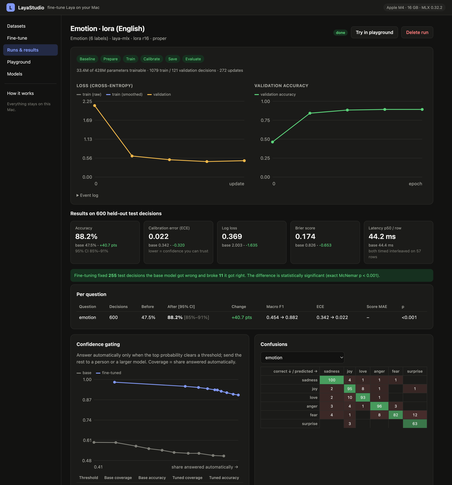
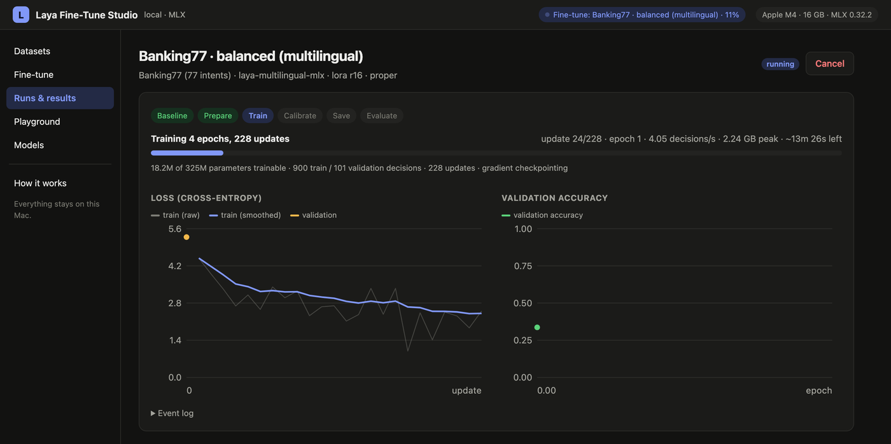

<div align="center">

# LayaStudio

**Fine-tune [Laya](https://github.com/NandhaKishorM/laya) typed-decision models on your own data, on your own Mac — and prove the result is better before you ship it.**

[](LICENSE)
[](https://www.python.org/)
[](https://github.com/ml-explore/mlx)
[](https://pypi.org/project/laya-mlx/)
[](#privacy-and-security)

```bash
git clone https://github.com/biplovgautam/LayaStudio && cd LayaStudio
uv run layastudio
```

That is the whole setup. The browser opens, and the studio finishes preparing itself in the background — it detects your Mac, checks the MLX runtime, downloads a base checkpoint and fetches the public example datasets, showing every step on the page.

</div>



---

## Why

Laya answers typed questions — `choice`, `score`, `noul` — in a single forward pass, locally, with calibrated probabilities and **zero generated tokens**. It is fast and free to run. But the public checkpoints are general-purpose: on one product's own decisions they are often fast and *not accurate enough*, the same pattern the community reports (Banking77 goes from ~51% to ~79% once fine-tuned).

The only published way to fine-tune Laya is a PyTorch notebook for two cloud GPUs, which means copying your data to someone else's machine. LayaStudio came out of needing the opposite: adapt Laya to a real product's decisions **on the laptop**, without the data ever leaving it, and with honest before/after measurement so "fine-tuned" is a number rather than a feeling.

It is built on top of [`laya-mlx`](https://pypi.org/project/laya-mlx/), the native MLX runtime for Laya, and it is a separate project: an app around that runtime, not a fork of it.

## What you get

|  |  |
|---|---|
| 🧪 **Honest measurement** | Every run scores the base model first, trains with early stopping, then scores both on the same untouched test split — with Wilson confidence intervals and an exact McNemar test |
| ⚡️ **LoRA on Apple silicon** | Low-rank adapters on the encoder plus the full decision head, in MLX. No PyTorch, no CUDA, no cloud |
| 🎛 **Calibration refit** | Temperatures refit per question type and option count, so the probabilities you gate on stay meaningful |
| 🔍 **Token-budget check** | Shows which rows get silently cut and which option labels get clipped *before* you spend an hour training |
| 🚦 **Production view** | Coverage/accuracy table for confidence gating, confusion matrices, and the most confident remaining mistakes |
| 📦 **Portable output** | LoRA merged back: a standard Laya checkpoint that loads in `laya-mlx` and in upstream PyTorch `laya` on Linux/NVIDIA |
| 🔒 **Local by construction** | Binds to 127.0.0.1, no external scripts in the page, jobs run with `HF_HUB_OFFLINE=1` |

## Install and run

Requirements: an Apple silicon Mac (M1 or newer), macOS 14+, Python 3.11+.

```bash
# with uv (recommended — creates the environment for you)
uv run layastudio

# or with pip
python3 -m venv .venv && source .venv/bin/activate
pip install -e .
layastudio
```

Useful flags: `--port 8800`, `--workspace ~/laya-work`, `--no-download` (never fetch a model), `--no-examples`, `--no-browser`.

### What the first start does

| Step | What happens |
|---|---|
| **Checking this Mac** | Chip, cores, memory, macOS — and the batch size and recipe that suit them |
| **Loading the MLX runtime** | `laya-mlx` and MLX versions, and how much memory the GPU may use |
| **Preparing the workspace** | Creates `workspace/`, counts what is already there, checks free disk space |
| **Getting a base model** | Downloads `aac6fef/laya-mlx` (English, 421M) into the Hugging Face cache, with a progress bar |
| **Fetching example datasets** | Pulls the public examples from their source URLs — nothing is stored in git |

Every step reports on the page, and nothing blocks you from looking around while it runs.

## Five-minute tour

1. **Datasets** → the examples are already there (Emotion, prompt injection, Banking77), or upload your own JSONL/CSV.
2. **Fine-tune** → pick a dataset, keep the *Balanced* recipe, press start. Watch loss and validation accuracy live.
3. **Runs & results** → read accuracy before/after, calibration, significance, gating and the remaining mistakes.
4. **Playground** → *Try in playground* compares the base and fine-tuned models side by side on any text.



## Measured results

Real runs on a **MacBook with an Apple M4 and 16 GB**, default *Balanced* recipe (LoRA r16 on every encoder layer + full decision head, 4 epochs, `proper` objective). Test rows were never trained on.

| Dataset | Base model | Train rows | Test decisions | Accuracy before → after | Macro F1 | ECE | Fixed / broke | McNemar p | Time |
|---|---|---:|---:|---|---|---|---|---|---:|
| Emotion, 6 labels | English 421M | 1,079 | 600 | **47.5% → 88.2%** | 0.45 → 0.88 | 0.342 → 0.022 | 255 / 11 | <1e-60 | 11.8 min |
| Prompt injection, yes/no | English 421M | 492 | 116 | **70.7% → 95.7%** | 0.69 → 0.96 | 0.280 → 0.027 | 29 / 0 | 4e-9 | 5.7 min |
| Banking77, 77 intents | Multilingual 322M | 900 | 770 | **34.2% → 64.2%** | 0.32 → 0.63 | 0.462 → 0.024 | 246 / 15 | 5e-55 | 18.4 min |

Notes, because numbers without caveats are marketing: Banking77 squeezes 77 labels into one option budget, so its labels are clipped to about four tokens each — that is the architecture's known weak spot, and its validation accuracy was still climbing at the last epoch (more epochs or the 421M English model would go further). The public community fine-tune reached ~79% with the English model and more data.

**Fine-tuning does not change latency.** Timed interleaved on the same rows: 44.4 ms (base) vs 44.2 ms (fine-tuned) per row, English model, 6-label questions.

**It does make confidence gating usable.** Emotion, answering only decisions the model is ≥90% sure about:

| | Answered automatically | Accuracy of those |
|---|---:|---:|
| Base | 49% | 59.3% |
| Fine-tuned | **76%** | **95.6%** |

Your numbers will differ — these are public benchmarks, not your traffic.

## Screenshots

| Token budget check | Confidence gating and confusions |
|---|---|
|  |  |

| Side-by-side playground | Datasets |
|---|---|
|  |  |

## How Laya works

Laya does not generate text. It **scores the options you give it**, one forward pass per question:

```text
[CLS] choice question: Which team should handle this? [SEP]
[MASK] billing: payments, refunds  [MASK] technical: bugs, outages  [MASK] other [SEP]
I was charged twice this month… [SEP]
        │
        ▼  bidirectional encoder: ModernBERT-large (421M) or mmBERT-base (322M)
        ▼  + question-type embedding (choice / score / noul)
        ▼  2-layer decision transformer
        ▼  scorer MLP at each [MASK] → one logit per option
        ▼  softmax(logits / fitted temperature) → calibrated probabilities
```

- `choice` picks a label, `score` rates on an ordered rubric, `noul` returns P(true).
- It can only answer with the options you provide, so it cannot invent a label — and it cannot say "none of these", so include an `other` option.
- The pretrained models were trained with **RLCD**: rewards from *strictly proper scoring rules* (log, spherical, ranked probability), which are maximized only by honest probabilities.

## How fine-tuning works here

1. **Baseline** — the base model answers the test split through the normal `predict` path (cached per model + dataset).
2. **LoRA** — every encoder attention/MLP matrix gets a trainable `W + (α/r)·A·B`; base weights stay frozen in bfloat16 while the decision head, scorer and type embedding train in float32. For the 421M English model: **33.4M of 428M** parameters.
3. **Objective** — `proper` (default) maximizes the RLCD reward directly; `rlcd` reproduces the upstream notebook (annealed Gaussian logit noise, group-normalized policy gradient, plus cross-entropy); `ce` is plain cross-entropy.
4. **Regularization** — choice options reshuffled every epoch so the model learns labels, not positions; head dropout 0.1 as upstream; optional class weighting.
5. **Early stopping** on validation loss, keeping the best epoch.
6. **Calibration** — temperatures refit per `(question type, option count)` on validation, clamped to [0.5, 5].
7. **Export** — LoRA merged into the weights; FP16 safetensors with the original PyTorch parameter names.
8. **Evaluation** — the fine-tuned model answers the same test rows; the report compares the two.

## Your data

**1. Questions** — the same object you already pass to `agent.predict`. Keep it identical after training: instructions and option texts are part of the model's input.

```json
{
  "intent":   {"type": "choice", "instructions": "What does the user want?",
               "criteria": {"billing": "payments, refunds", "technical": "bugs, errors", "other": "anything else"}},
  "urgency":  {"type": "score", "instructions": "How urgent is this?",
               "criteria": ["can wait", "soon", "blocking right now"]},
  "escalate": {"type": "noul", "instructions": "Should a human take over?"}
}
```

**2. Labeled rows** — JSONL, a JSON array, or CSV/TSV.

```json
{"state": "I was charged twice this month", "answers": {"intent": "billing", "urgency": 1, "escalate": false}}
{"state": [{"role": "user", "content": "app crashes on login"}], "answers": {"intent": "technical"}}
{"state": {"subject": "Invoice", "body": "…"}, "answers": {"intent": {"billing": 0.7, "other": 0.3}}}
```

- `state` is text, a JSON object, or a conversation — exactly what you will send in production.
- A row may label any subset of the questions.
- `choice` → the label · `score` → the level index from 0 · `noul` → `true`/`false` or a probability.
- `{label: probability}` is a **soft label**: for disagreeing annotators, or to distil a larger model's judgments into Laya.
- `"split": "train" | "val" | "test"` pins a row; otherwise rows split 80/10/10, stratified by label.
- CSV needs a `state` (or `text`) column plus one column per question id.

**How much?** ~30 examples per label to start, 100+ to be solid; 200+ test decisions so the confidence interval is tight enough to act on. Run the **token budget check** first: the English model reads 512 tokens and the multilingual one 1,024, longer states are cut from the end silently, and option texts share a 192/256-token budget.

## Recipes

| Recipe | What trains | When |
|---|---|---|
| **Balanced** (default) | LoRA on every encoder layer + full decision head | Best accuracy per minute; start here |
| **Fast** | LoRA on the top 8 encoder layers | Iterating on data or labels |
| **Head only** | Decision head, scorer, type embedding | Quick sanity check |
| **Full top layers** | Top 4 encoder layers unfrozen, lower LR | Large datasets where LoRA plateaus |

Advanced settings cover epochs, batch size, gradient accumulation, learning rates, LoRA rank/alpha, objective, class weighting, precision, option shuffling, patience and seed. Defaults are in `HYPERPARAMETERS` in [`layastudio/engine.py`](layastudio/engine.py), and the studio adapts batch size to the memory it finds.

## Performance and memory

| | English 421M | Multilingual 322M |
|---|---|---|
| Training throughput (Balanced, M4) | ~7 decisions/s | ~4 decisions/s at 77 options |
| Peak GPU memory, 512-token batches | **2.6 GB** | 2.3 GB |
| Inference after fine-tuning | unchanged | unchanged |

Three things keep long inputs safe on a 16 GB machine, each found by measuring:

- **Gradient checkpointing** turns on automatically for long batches: 13.6 GB → 2.9 GB at 512 tokens, at the same speed.
- **Gradients are materialized every microbatch.** A lazy graph spanning microbatches, the gradient clip and the optimizer step peaked at 12.3 GB; the same epoch now peaks at 2.6 GB.
- **MLX's buffer cache is capped.** Uncapped, it grew past 10 GB in a few dozen steps as batch shapes varied, and pushed the machine into swap.

## The checkpoint, and other hardware

```
workspace/runs/<run>/model/
├── model.safetensors      FP16, original PyTorch parameter names (LoRA merged)
├── rl_agent_config.json   refit temperatures + fine-tuning provenance
├── encoder/config.json    tokenizer/
├── questions.json         the questions this model was trained for
└── laya_finetune.json     base model, dataset hash, hyperparameters, metrics
```

```python
import json, laya_mlx as laya

agent = laya.load("workspace/runs/<run>/model")
questions = json.load(open("workspace/runs/<run>/model/questions.json"))
agent.predict("your text", questions)
```

Because the layout and tensor names match the original checkpoints, the same folder loads in the upstream PyTorch `laya` package on Linux CPUs and NVIDIA GPUs. Verified rather than assumed: a fine-tuned checkpoint loaded with upstream `laya` on CPU gave **40/40 identical answers** and a maximum probability difference of **0.0000** against this MLX runtime.

**Roadmap:** training on NVIDIA GPUs and Linux; one-click exports from the same checkpoint (ONNX for CPU/CUDA servers, Core ML for the Apple Neural Engine, LiteRT for Android and NPUs, quantized variants); a batch scoring CLI; and an experiment on retraining the escalation head.

## Privacy and security

- Binds to `127.0.0.1` only, rejects other host names (DNS rebinding) and cross-origin requests, and accepts JSON bodies only, so a web page cannot drive it.
- The UI loads no external scripts, fonts or analytics — a strict Content-Security-Policy enforces it.
- Training and evaluation run with `HF_HUB_OFFLINE=1`. The only network actions are model downloads and the public example datasets.
- Your datasets, runs and checkpoints live in `workspace/`, which git ignores.

## Project layout

| Path | What it is |
|---|---|
| [`layastudio/server.py`](layastudio/server.py) | The app in one file: JSON API + web UI, standard library only, no build step |
| [`layastudio/engine.py`](layastudio/engine.py) | MLX engine: data parsing, token analysis, LoRA training, calibration, evaluation, export |
| [`layastudio/bootstrap.py`](layastudio/bootstrap.py) | The background first-run setup described above |
| [`layastudio/examples.py`](layastudio/examples.py) | Public example datasets, fetched from their URLs |
| [`docs/screenshots.py`](docs/screenshots.py) | Regenerates the screenshots in this README from a running studio |
| `tests/` | Unit and end-to-end tests against a tiny random model |

Jobs run as child processes of `layastudio.engine`, so a crash, a cancel or an out-of-memory error never takes the UI down, and GPU memory returns to the system when a job ends.

```bash
uv run pytest -q          # 13 tests, no downloads, ~20 s
uv run ruff check .
```

## FAQ

**Does fine-tuning make inference slower or the model bigger?** No. LoRA is merged into the weights; the file and the forward pass are exactly the base model's.

**Can I keep using the general checkpoint for other questions?** The fine-tuned model specializes. Evaluate anything else you depend on, or keep two checkpoints and route between them.

**My accuracy barely moved.** Check the token budget page (cut states, clipped labels), whether labels are consistent, and that you evaluate the same questions you trained on. A small gain with a large p-value usually means not enough data.

**Can I train on labels from a bigger model?** Yes — that is what soft labels are for. Feed the teacher's probabilities as `{label: probability}`.

**Do I need the internet?** Only for the first model download and the optional example datasets.

**Windows or Linux?** Not for training yet — MLX is Apple silicon only. The checkpoints you produce already run on Linux and NVIDIA through the upstream runtime, and training support there is on the roadmap.

## Credits

- **Laya** and its pretrained weights: [Convai Innovations](https://github.com/NandhaKishorM/laya) (Apache-2.0). The training objective here follows their RLCD fine-tuning notebook.
- **laya-mlx**: the native MLX runtime this studio builds on ([PyPI](https://pypi.org/project/laya-mlx/), [GitHub](https://github.com/mizorewww/laya-mlx)).
- **MLX**: [Apple's array framework](https://github.com/ml-explore/mlx) for Apple silicon.

LayaStudio is an independent project and is not affiliated with Convai Innovations. Licensed under [Apache-2.0](LICENSE); see [NOTICE](NOTICE).
